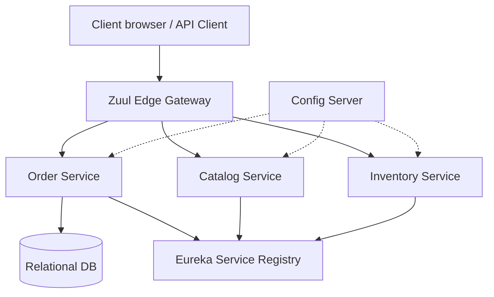

# Distributed Order Management System (DOMS)

Distributed Order Management System (DOMS) is an enterprise-grade microservices platform designed for high-performance order processing, lifecycle tracking, and inventory management. Built on a foundation of Spring Boot and Spring Cloud, DOMS demonstrates advanced distributed system patterns including service discovery, centralized configuration, and fault-tolerant resilience.

## 🌟 Key Features

*   **End-to-End Order Lifecycle Tracking**: Robust state machine managing transitions from `CREATED` through `SHIPPED` and `DELIVERED`.
*   **Built-in Resilience**: Implementation of **Spring Retry** protocols to automatically manage transient service failures with exponential backoff.
*   **Asynchronous Processing**: Scalable architecture ready for event-driven workflows and high-concurrency order surges.
*   **Service Discovery & Load Balancing**: Dynamic service registration using Netflix Eureka for seamless microservice communication.
*   **Centralized Configuration**: Externalized configuration management for multi-environment deployment stability.
*   **Operational Observability**: Real-time metrics dashboard and structured logging for comprehensive system health monitoring.

## 🏗 System Architecture



## 🛠 Technology Stack

*   **Core**: Java 8, Spring Boot 2.0.x
*   **Microservices**: Spring Cloud (Finchley), Netflix Eureka, Zuul, Hystrix
*   **Data Persistence**: Spring Data JPA, Hibernate, H2/MySQL
*   **Resilience**: Spring Retry, AspectJ
*   **Monitoring**: Spring Boot Actuator, Zipkin, Hystrix Dashboard
*   **DevOps**: Docker, Docker Compose

## 📡 API Documentation (Order Service)

| HTTP Method | API Endpoint | Description |
| :--- | :--- | :--- |
| `POST` | `/api/orders` | Initialize a new order processing workflow. |
| `GET` | `/api/orders/{id}` | Retrieve comprehensive details for a specific order. |
| `GET` | `/api/orders/{id}/status` | Check the real-time fulfillment status of an order. |
| `GET` | `/api/metrics/orders` | Access high-level system performance and order success metrics. |

## ⚙️ Deployment & Execution

### 1. Build & Package
Using the Maven wrapper, compile and package all system modules:
```bash
./mvnw clean package -DskipTests=true
```

### 2. Infrastructure Initialization
Deploy the core infrastructure components (MySQL, RabbitMQ, Config Server, Service Registry) using the provided orchestration script:
```bash
./run.sh start_infra
```

### 3. Service Deployment
Launch the primary business logic services:
```bash
./run.sh start order-service
./run.sh start catalog-service
./run.sh start inventory-service
```

### 4. System Access Points
*   **API Gateway**: `http://localhost:8080/api/`
*   **Service Discovery Console**: `http://localhost:8761/`
*   **Resilience Dashboard**: `http://localhost:8788/hystrix`

## 📊 System Metrics Example
Endpoint: `GET /api/metrics/orders`
```json
{
    "total_orders": 1250,
    "failed_orders": 5,
    "success_orders": 1245,
    "success_rate": "99.60%"
}
```

---
© 2026 Distributed Order Management System (DOMS)