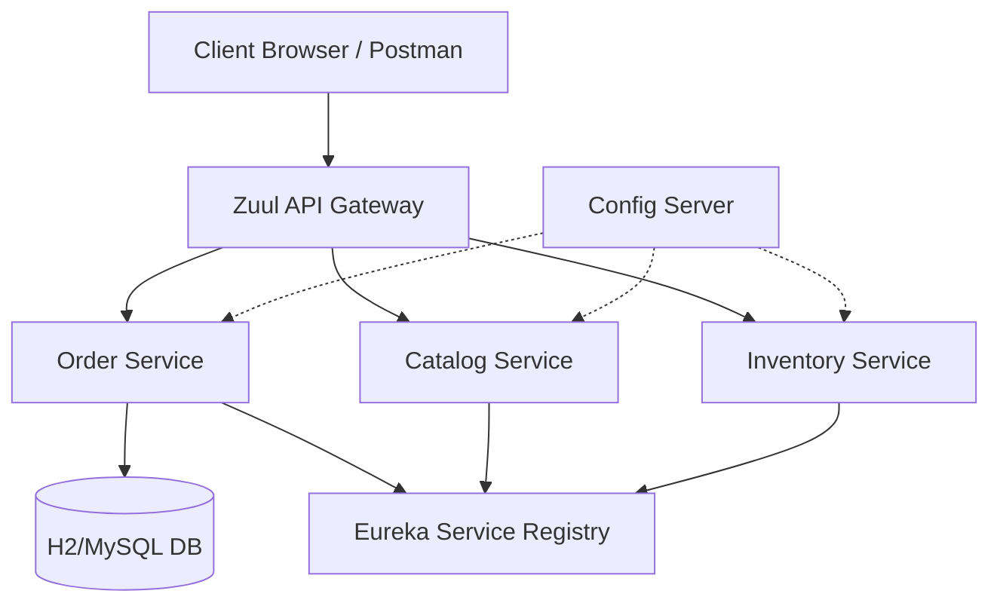

# Distributed Order Management System (DOMS)

Distributed Order Management System (DOMS) is a production-grade microservices-based platform designed for efficient order processing, tracking, and management. It leverages Spring Boot and Spring Cloud to provide a scalable, resilient architecture.

## 🚀 Key Features

- **End-to-End Order Tracking**: Monitor order states from `CREATED` to `DELIVERED`.
- **High Resilience**: Automated retry logic for order processing using Spring Retry.
- **Microservices Architecture**: Independently deployable services for catalog, inventory, and orders.
- **Service Discovery & Config**: Centralized configuration and Eureka-based service discovery.
- **Observability**: Structured logging and real-time metrics dashboard endpoints.
- **Edge Gateway**: Simplified API access through Zuul gateway.

## 🏗 Architecture



## 🛠 Tech Stack

- **Backend**: Java 8, Spring Boot 2.0.0.RELEASE
- **Frameworks**: Spring Cloud (Finchley), Spring Data JPA
- **Database**: H2 (In-memory), MySQL (Optional)
- **messaging**: RabbitMQ (for future scaling)
- **Monitoring**: Spring Actuator, Hystrix Dashboard, Zipkin

## 📡 API Endpoints (Order Service)

| Method | Endpoint | Description |
| :--- | :--- | :--- |
| POST | `/api/orders` | Create a new order |
| GET | `/api/orders/{id}` | Get order details |
| GET | `/api/orders/{id}/status` | Get real-time order status |
| GET | `/api/metrics/orders` | Get system-wide order metrics |

## ⚙️ How to Run

### 1. Build the Modules
```bash
./mvnw clean package -DskipTests=true
```

### 2. Start Infrastructure
Run the included helper script to start MySQL, RabbitMQ, Config Server, and Service Registry:
```bash
./run.sh start_infra
```

### 3. Start DOMS Services
Start the core microservices:
```bash
./run.sh start order-service
./run.sh start catalog-service
./run.sh start inventory-service
```

### 4. Access the System
- **API Gateway**: `http://localhost:8080/api/`
- **Service Registry**: `http://localhost:8761/`
- **Hystrix Dashboard**: `http://localhost:8788/hystrix`

## 📊 Metrics Sample Output
`GET /api/metrics/orders`
```json
{
    "total_orders": 150,
    "failed_orders": 3,
    "success_orders": 147,
    "success_rate": "98.00%"
}
```

---
*Transformed from Spring Boot Microservices Series by Antigravity AI.*