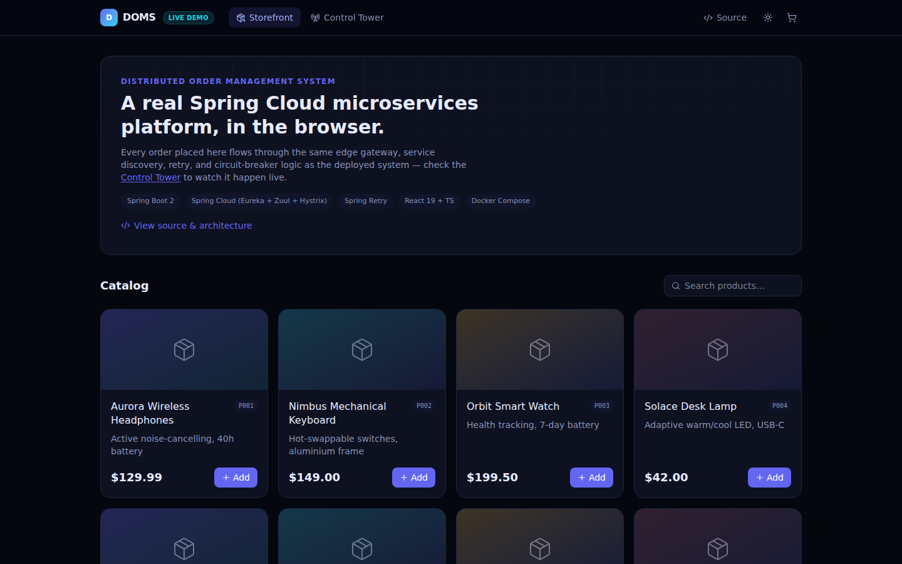
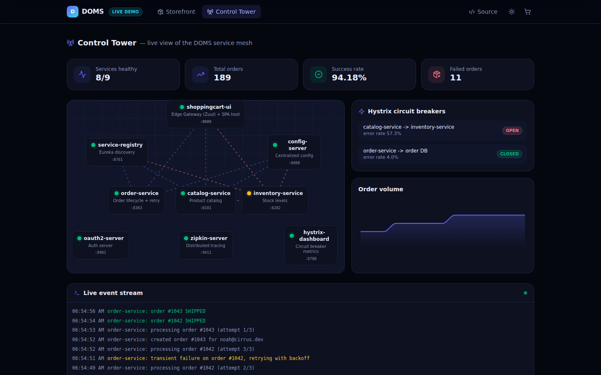
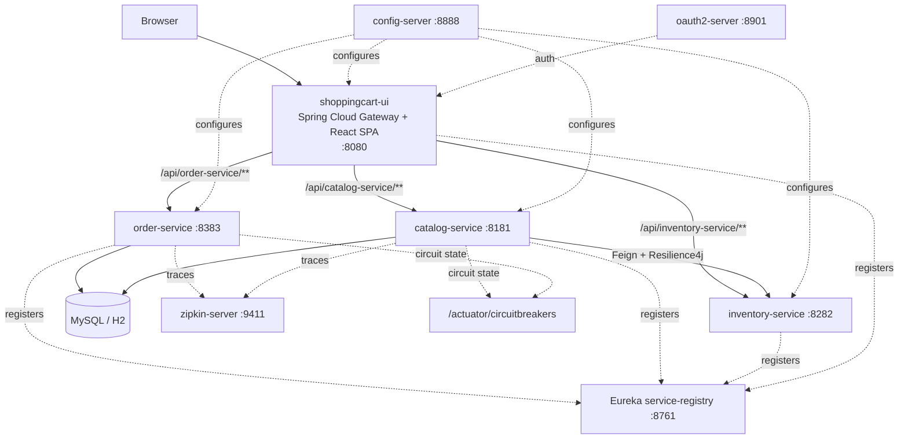
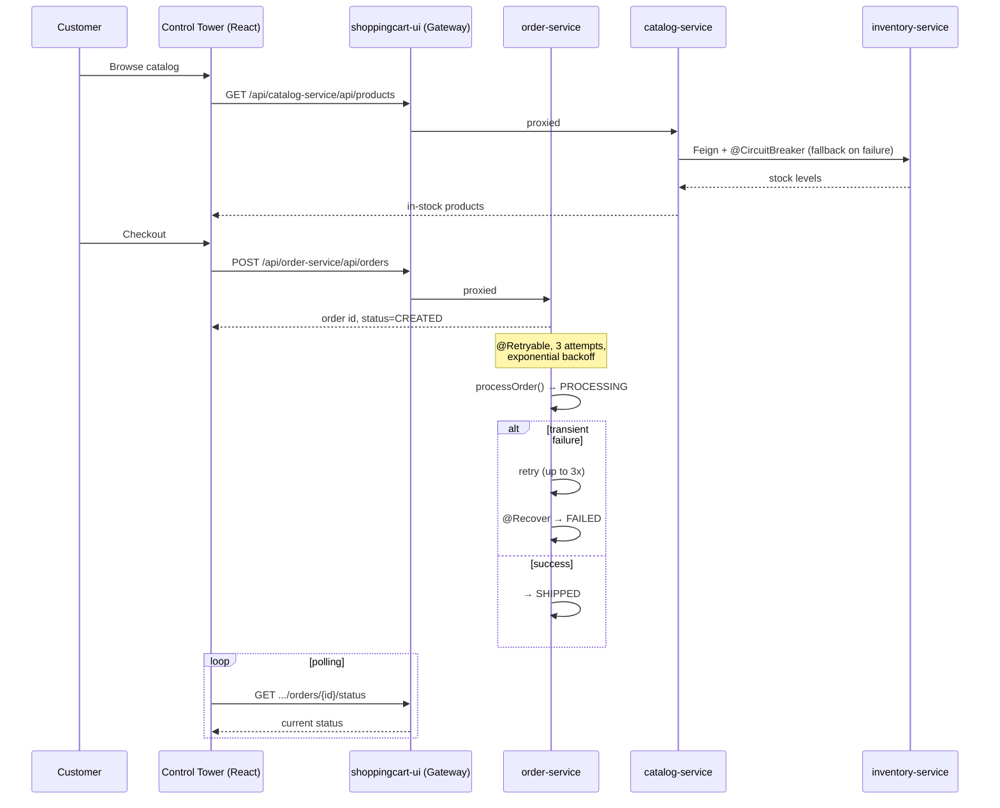

<div align="center">

# 📦 DOMS — Distributed Order Management System

<strong>A Spring Cloud microservices platform with a real-time React operations console.</strong>

[](https://github.com/tanmaymish/doms-order-service/actions/workflows/ci.yml)
[](https://tanmaymish.github.io/doms-order-service/)


[**🌐 Live Demo**](https://tanmaymish.github.io/doms-order-service/) &nbsp;·&nbsp;
[**🏗 Architecture**](#-system-architecture) &nbsp;·&nbsp;
[**🚀 Run it locally**](#-running-locally) &nbsp;·&nbsp;
[**✅ Testing & quality**](#-testing--quality)

</div>

---

## 🎯 Overview

DOMS is a distributed order-processing platform built on Spring Boot + Spring
Cloud (Netflix stack): independent services for orders, catalog, and
inventory, fronted by a Spring Cloud Gateway edge, discovered via Eureka, configured
centrally, protected by circuit breakers, and traced end-to-end with Zipkin.

On top of it sits **Control Tower** — a React + TypeScript console that
doubles as the storefront and as a live view into the mesh: service health,
Resilience4j circuit-breaker state, order throughput, and a real-time event feed
of every retry, failure, and shipment as it happens.

<p align="center">
  
  
</p>

> The [live demo](https://tanmaymish.github.io/doms-order-service/) runs a
> client-side simulation of the backend (same order lifecycle, retry, and
> circuit-breaker logic, no server required) so you can click around without
> standing up nine services and a database. Point the same build at a real
> deployment and it talks to the actual gateway instead — see
> [Demo mode vs. live mode](#demo-mode-vs-live-mode).

---

## 🏗 System Architecture

`shoppingcart-ui` does double duty: it's a Spring Cloud Gateway edge *and*
the host for the compiled React console (served as static resources on the
same origin, so there's no separate frontend deployment or CORS to
configure). It runs the MVC flavour of Gateway precisely so one servlet app
can do both. Routes are declared in its `application.yml` and resolve through
Eureka with `lb://`.


```mermaid
graph TD
    Client[Browser] --> UI["shoppingcart-ui<br/>Spring Cloud Gateway + React SPA<br/>:8080"]

    UI -->|/api/order-service/**| Orders[order-service :8383]
    UI -->|/api/catalog-service/**| Catalog[catalog-service :8181]
    UI -->|/api/inventory-service/**| Inventory[inventory-service :8282]

    Orders --> DB[(MySQL / H2)]
    Catalog -->|Feign + Resilience4j| Inventory
    Catalog --> DB

    Orders -.registers.-> Registry[Eureka service-registry :8761]
    Catalog -.registers.-> Registry
    Inventory -.registers.-> Registry
    UI -.registers.-> Registry

    Config[config-server :8888] -.configures.-> Orders
    Config -.configures.-> Catalog
    Config -.configures.-> Inventory
    Config -.configures.-> UI

    Orders -.traces.-> Zipkin[zipkin-server :9411]
    Catalog -.traces.-> Zipkin

    Catalog -.circuit state.-> Actuator["/actuator/circuitbreakers"]
    Orders -.circuit state.-> Actuator

    OAuth[oauth2-server :8901] -.auth.-> UI
```

### Order lifecycle


```mermaid
sequenceDiagram
    participant User as Customer
    participant UI as Control Tower (React)
    participant Gateway as shoppingcart-ui (Gateway)
    participant Orders as order-service
    participant Catalog as catalog-service
    participant Inventory as inventory-service

    User->>UI: Browse catalog
    UI->>Gateway: GET /api/catalog-service/api/products
    Gateway->>Catalog: proxied
    Catalog->>Inventory: Feign + @CircuitBreaker (fallback on failure)
    Inventory-->>Catalog: stock levels
    Catalog-->>UI: in-stock products

    User->>UI: Checkout
    UI->>Gateway: POST /api/order-service/api/orders
    Gateway->>Orders: proxied
    Orders-->>UI: order id, status=CREATED

    Note over Orders: @Retryable, 3 attempts,<br/>exponential backoff
    Orders->>Orders: processOrder() → PROCESSING
    alt transient failure
        Orders->>Orders: retry (up to 3x)
        Orders->>Orders: @Recover → FAILED
    else success
        Orders->>Orders: → SHIPPED
    end

    loop polling
        UI->>Gateway: GET .../orders/{id}/status
        Gateway-->>UI: current status
    end
```

---

## ⚡ Key capabilities

- **Edge gateway + service discovery** — Spring Cloud Gateway routes to
  catalog, order and inventory through Eureka (`lb://`), so there are no
  hardcoded hostnames and no service is exposed at the edge by accident.
- **Resilience** — `@Retryable`/`@Recover` on the order-processing path
  (3 attempts, exponential backoff) and Resilience4j `@CircuitBreaker` fallbacks on the
  catalog → inventory call, so a slow/unavailable inventory-service degrades
  gracefully instead of taking checkout down with it.
- **Centralized config** — every service pulls its properties from
  `config-server` at boot; per-environment overrides live in one repo.
- **Distributed tracing** — Micrometer Tracing (Brave) + Zipkin correlate a request across
  gateway → catalog → inventory.
- **Real-time operations console** — Control Tower polls (or, in demo mode,
  simulates) service health, circuit-breaker state, and order throughput,
  and shows a live event stream of what the mesh is doing.
- **Real test coverage** — JUnit + Mockito unit tests and MockMvc
  integration tests for the order/catalog/inventory business logic, with
  JaCoCo coverage reports published on every CI run (see
  [Testing & quality](#-testing--quality)).

---

## 🛠 Technology stack

| Layer | Technology |
| :--- | :--- |
| **Core services** | Java 21, Spring Boot 3.5 |
| **Microservices** | Spring Cloud 2025.0, Spring Cloud Gateway (MVC), Netflix Eureka, OpenFeign |
| **Security** | Spring Security 6, Spring Authorization Server (OAuth2 / OIDC, JWT) |
| **Persistence** | Spring Data JPA, Hibernate, H2 (default) / MySQL (docker profile) |
| **Resilience** | Spring Retry, Resilience4j circuit breakers, AspectJ |
| **Observability** | Spring Boot Actuator, Micrometer Tracing (Brave), Zipkin |
| **Frontend** | React 19, TypeScript, Vite, Tailwind CSS v4, Recharts, Framer Motion |
| **Testing** | JUnit 5, Mockito, MockMvc, MockWebServer, JaCoCo, oxlint |
| **DevOps** | Docker, Docker Compose, GitHub Actions, GitHub Pages |

---

## Stack migration

Every module runs on **Spring Boot 3.5 / Spring Cloud 2025.0 / Java 21**. The starting point
was Spring Boot 2.0.0.RELEASE (March 2018), Spring Cloud Finchley.M8 — a *milestone* build,
resolved from `repo.spring.io/milestone` — and Java 8.

| Was | Is | Why |
| --- | --- | --- |
| Hystrix | Resilience4j | Out of maintenance since 2018 and no longer in Spring Cloud |
| Zuul 1 (`@EnableZuulProxy`) | Spring Cloud Gateway (MVC) | Zuul 1 was dropped from Spring Cloud in 2020 |
| Spring Security OAuth2 | Spring Authorization Server | Removed outright in Spring Security 6 |
| Sleuth + `spring-cloud-starter-zipkin` | Micrometer Tracing (Brave) | Both removed in Spring Cloud 2022 |
| `bootstrap.properties` | `spring.config.import` | The bootstrap context was removed in Spring Cloud 2020, so those files were being ignored |
| `javax.*` | `jakarta.*` | Jakarta EE 9 package rename, required by Boot 3 |
| JUnit 4 + `SpringRunner` | JUnit 5 | Boot 3's test starter ships JUnit 5 only |
| `mysql:mysql-connector-java` | `com.mysql:mysql-connector-j` | Driver moved coordinates |
| `fabric8/java-alpine-openjdk8-jre` | `eclipse-temurin:21-jre-alpine` | The old base image is abandoned, ran as root, and opened a debugger port on every container |

Two modules were retired rather than migrated:

- **`hystrix-dashboard`** had no modern equivalent. Resilience4j publishes breaker state at
  `/actuator/circuitbreakers` and events at `/actuator/circuitbreakerevents`, which Control
  Tower reads directly.
- **`zipkin-server`** wrapped `@EnableZipkinServer`, which Zipkin itself deprecated in 2018 —
  and `docker-compose.yml` was already running the official `openzipkin/zipkin` image, so the
  module was never in the path of a single trace.

### Three behavioural changes worth knowing

**The implicit and password OAuth2 grants are gone.** `client1` used to be registered for
`authorization_code, implicit, password, client_credentials, refresh_token`. OAuth 2.1 removes
the first two — implicit returns tokens in a URL fragment where they leak through browser
history and referrer headers, and password hands the client the user's actual credentials —
and Spring Authorization Server does not implement them. Tokens are now signed JWTs with a
published JWKS rather than opaque strings from an in-memory store, and PKCE is required.

**The gateway no longer proxies whatever happens to be registered.** Zuul's `zuul.prefix=/api`
plus its Eureka route locator meant every service in the registry was reachable from outside,
whether or not anyone decided it should be. The three routes are written down now.

**A single failed login no longer counts as privilege escalation** — that is a `mini-soc`
change, but the same instinct: defaults that alert on ordinary behaviour are not security.

### Bugs found on the way

- `service-registry` set `eureka.instance.client.registerWithEureka` and
  `.fetchRegistry`. Those bind to nothing — the properties are `eureka.client.*` — so the
  registry had been silently trying to register with and fetch from itself.
- `ContextCopyHystrixConcurrencyStrategy` existed only to copy a correlation id across
  Hystrix's thread pool. Resilience4j runs on the caller's thread, so the class is gone.
- `StripPrefix` on a gateway route counts segments on the full request URI, *including* the
  servlet context path, while the `Path` predicate matches the path with the context path
  already removed. The first version of the routes stripped two segments and quietly proxied
  `/catalog-service/api/products` downstream. `GatewayRoutingTest` asserts the exact path the
  backend receives, so this fails loudly now instead of silently.

---

## 🚀 Running locally

### Full stack (Docker Compose)

```bash
git clone https://github.com/tanmaymish/doms-order-service.git
cd doms-order-service
./run.sh start_all       # builds every module (frontend included) and starts the full stack
```

* **Storefront + Control Tower**: http://localhost:8080/ui/
* **API Gateway**: http://localhost:8080/ui/api/
* **Service Discovery**: http://localhost:8761/
* **Circuit breaker state**: http://localhost:8181/actuator/circuitbreakers
* **Distributed Tracing**: http://localhost:9411/ (official `openzipkin/zipkin` image)
* **Authorization Server**: http://localhost:8901/authserver/.well-known/oauth-authorization-server

`shoppingcart-ui`'s Maven build compiles the React console automatically
(via `frontend-maven-plugin`, bound to `generate-resources`) — there's no
separate `npm run build` step and nothing built is committed to git.

### Frontend only, against a running gateway

```bash
cd shoppingcart-ui/frontend
npm install
npm run dev          # proxies /ui/api to localhost:8080, see vite.config.ts
```

### Demo mode vs. live mode

The console has two modes, selected at build time:

| | **Live mode** (default) | **Demo mode** (`VITE_DEMO_MODE=true`) |
| :--- | :--- | :--- |
| Product catalog, orders, metrics | Real gateway calls to `order-service` / `catalog-service` | Fully simulated in-browser, including the 30% retry-failure rate and circuit-breaker trips |
| Service health (Control Tower) | Polls each service's `/actuator/health` through the gateway | Simulated |
| Use case | The actual deployed stack | [GitHub Pages demo](https://tanmaymish.github.io/doms-order-service/) — zero infrastructure |

This is exactly what ships to `shoppingcart-ui`'s static resources at build
time vs. what the [`deploy-pages.yml`](.github/workflows/deploy-pages.yml)
workflow publishes — same codebase, different `VITE_DEMO_MODE` flag.

---

## 📡 API reference

### order-service

| Method | Endpoint | Description |
| :--- | :--- | :--- |
| `POST` | `/api/orders` | Create an order (starts in `CREATED`, async-processes to `SHIPPED`/`FAILED`) |
| `GET` | `/api/orders/{id}` | Full order detail |
| `GET` | `/api/orders/{id}/status` | Lightweight status poll |
| `GET` | `/api/metrics/orders` | Aggregate success/failure counts |

### catalog-service / inventory-service

| Method | Endpoint | Description |
| :--- | :--- | :--- |
| `GET` | `/api/products` | In-stock products (cross-checked against `inventory-service`) |
| `GET` | `/api/products/{code}` | Single product, with live stock flag |
| `GET` | `/api/inventory` | Raw stock levels |
| `GET` | `/api/inventory/{code}` | Stock level for one product |

All of the above are reachable through the gateway at
`/ui/api/{service-id}/...`, e.g. `/ui/api/order-service/api/orders`.

---

## ✅ Testing & quality

```bash
./mvnw test                              # every module, JDK 21
cd shoppingcart-ui/frontend && npm run lint && npm run build
```

38 tests, all JUnit 5.

- **order-service**: retry/backoff logic, metrics aggregation, controller
  contracts (`OrderServiceTest`, `OrderControllerTest`).
- **catalog-service**: stock-aware product filtering, inventory-lookup
  fallbacks, controller contracts (`ProductServiceTest`, `ProductControllerTest`).
- **inventory-service**: inventory lookup endpoints (`InventoryControllerTest`).

CI runs the full suite on every push/PR (no `-DskipTests`), publishes a JaCoCo coverage
summary to the workflow run, and uploads the HTML reports as build artifacts. The frontend is linted (`oxlint`) and type-checked
(`tsc -b`) in a separate, faster job.

---

## 📦 Deployment

| Layer | Where | How |
| :--- | :--- | :--- |
| **Demo console** | GitHub Pages | Auto-deploys on push to `main` via [`deploy-pages.yml`](.github/workflows/deploy-pages.yml) (client-side simulation, zero infra). |
| **Full stack** | Any Docker host | `./run.sh start_all` — see [`docker-compose.yml`](docker-compose.yml). |

**Enable GitHub Pages** (one time): repo **Settings → Pages → Source: Deploy
from a branch → `gh-pages` / `(root)`**. The workflow creates that branch on
its first run.

---

<div align="center">
  <sub>Built to demonstrate distributed systems fundamentals: service discovery, resilience, observability, and a UI that doesn't lie about any of it.</sub>
</div>
